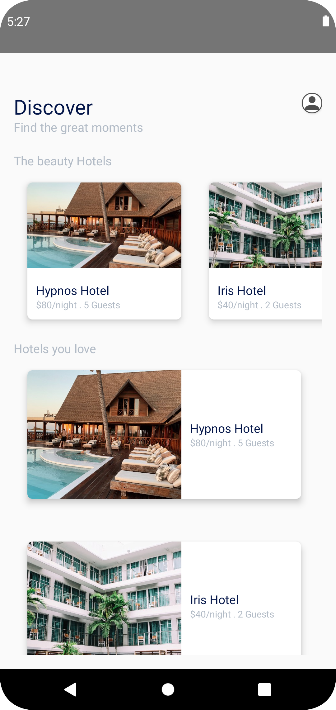
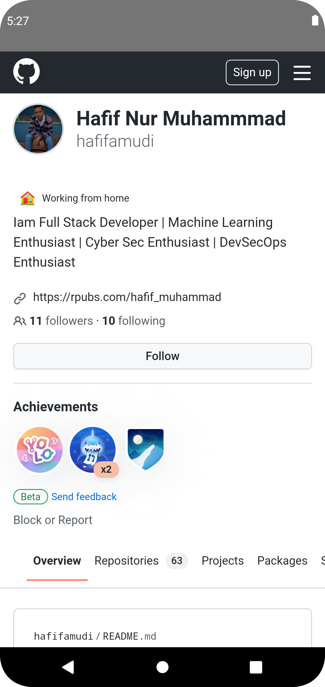

# Android-Pemula-Submission-Dicoding
This is a Simple Android App for dicoding Android Pemula Submission

> Splash Screen & Home Screen

> Detail Screen & About Screen

> Portofolio Screen (Web View)

